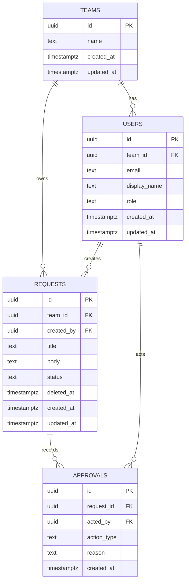

# ERD: MiniFlow (v0.1)

## 1. 目的
MiniFlowのMVPで利用するデータモデルを定義する。  
本書は `PRD` / `NFR` / `IMPLEMENTATION_GUIDE` と整合するDB設計の基準とする。

## 2. 対象テーブル（MVP）
- `teams`
- `users`
- `requests`
- `approvals`

## 3. ER図（Mermaid）


記法メモ:
- `||--o{` は 1対多（1側に必須1、N側は0以上）を示す
- `records` / `acts` はリレーションの説明ラベルで、テーブル名ではない
  - `REQUESTS ||--o{ APPROVALS : records` は「1つのRequestが複数Approval履歴を持つ」
  - `USERS ||--o{ APPROVALS : acts` は「1人のUserが複数Approval操作を行う」

## 4. テーブル定義
### 4.1 teams
- `id uuid PK`
- `name text not null`
- `created_at timestamptz not null default now()`
- `updated_at timestamptz not null default now()`

### 4.2 users
- `id uuid PK`
- `team_id uuid not null references teams(id)`
- `email text not null unique`
- `display_name text not null`
- `role text not null`  
  例: `member`, `approver`, `admin`
- `created_at timestamptz not null default now()`
- `updated_at timestamptz not null default now()`

### 4.3 requests
- `id uuid PK`
- `team_id uuid not null references teams(id)`
- `created_by uuid not null references users(id)`
- `title text not null`
- `body text not null`
- `status text not null`  
  許容値: `Draft`, `Pending`, `Approved`, `Rejected`, `Deleted`
- `deleted_at timestamptz null`
- `created_at timestamptz not null default now()`
- `updated_at timestamptz not null default now()`

### 4.4 approvals
- `id uuid PK`
- `request_id uuid not null references requests(id)`
- `acted_by uuid not null references users(id)`
- `action_type text not null`  
  許容値: `Approved`, `Rejected`
- `reason text null`
- `created_at timestamptz not null default now()`

## 5. 制約（重要）
### 5.1 status / deleted_at 整合制約
- `status = 'Deleted' <=> deleted_at IS NOT NULL`
- `status != 'Deleted' <=> deleted_at IS NULL`

実装例（CHECK）:
```sql
CHECK (
  (status = 'Deleted' AND deleted_at IS NOT NULL)
  OR
  (status <> 'Deleted' AND deleted_at IS NULL)
)
```

### 5.2 approvals の履歴制約
- `approvals` は insert only（更新・削除しない）
- `action_type` は `Approved` / `Rejected` のみ

### 5.3 重複承認の抑止（MVP）
同一Requestに対する同一actorの重複決裁を禁止する。
```sql
CREATE UNIQUE INDEX uq_approvals_request_actor
  ON approvals (request_id, acted_by);
```

## 6. インデックス方針（MVP）
### 6.1 requests
- 一覧検索用:
```sql
CREATE INDEX idx_requests_team_status_created_at
  ON requests (team_id, status, created_at DESC);
```
- 削除除外検索を高速化:
```sql
CREATE INDEX idx_requests_not_deleted
  ON requests (team_id, created_at DESC)
  WHERE deleted_at IS NULL;
```

### 6.2 approvals
- 履歴取得用:
```sql
CREATE INDEX idx_approvals_request_created_at
  ON approvals (request_id, created_at ASC);
```

## 7. 取得ルール（API観点）
- 一覧APIはデフォルトで `deleted_at IS NULL` を適用（Deleted非表示）
- 詳細APIはDeletedを取得可能（監査用途）
- Request詳細取得時はApproval履歴を `created_at ASC` で返す

## 8. UUID方針
- 主キーは全テーブル `uuid`
- 生成方式は `UUIDv7` 推奨
- 導入難度が高い場合はMVPとして `gen_random_uuid()` で開始可

## 9. 将来拡張メモ
- 多段承認対応時は `approvals` に `step` / `sequence` 追加を検討
- revise履歴が必要になった場合は `action_type='Revised'` を導入

## 10. 関連ドキュメント
- [PRD.md](/Users/admin/WebPortfolio/MiniFlow/docs/PRD.md)
- [NFR.md](/Users/admin/WebPortfolio/MiniFlow/docs/NFR.md)
- [IMPLEMENTATION_GUIDE.md](/Users/admin/WebPortfolio/MiniFlow/docs/IMPLEMENTATION_GUIDE.md)
